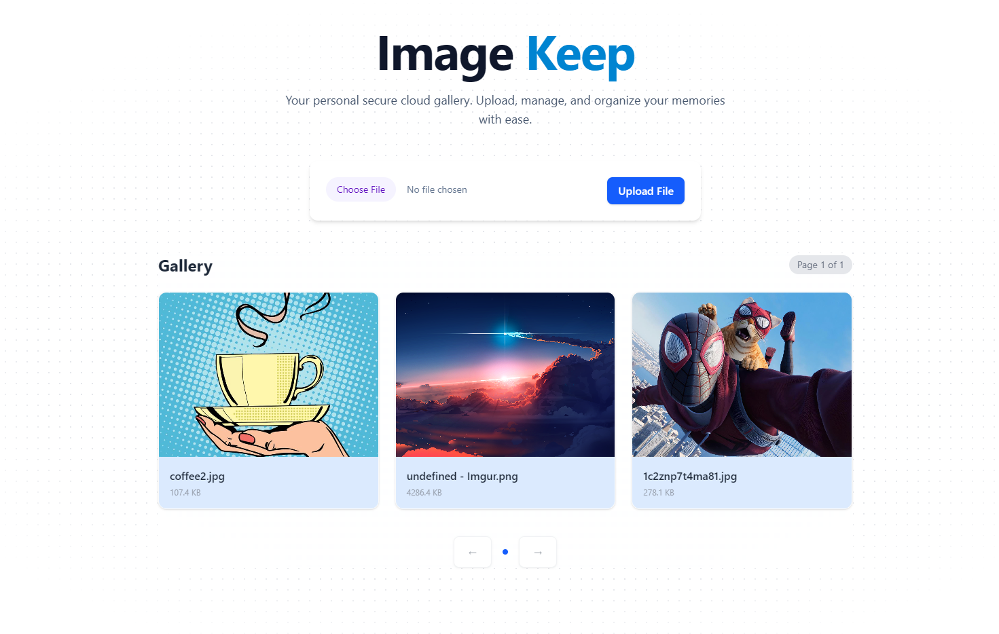

# Image Keep 

A modern, full-stack file management system built to securely upload, view, and manage images. Features a responsive glassmorphism UI, real-time toast notifications, and optimistic UI updates.

## 🚀 Tech Stack

**Frontend:**
* React (Vite)
* Tailwind CSS (Styling)
* React Toastify (Notifications)

**Backend:**
* Python (Flask)
* SQLAlchemy (Database)
* SQLite (Local Storage)

## ✨ Features

* **File Upload:** Drag-and-drop style interface with mime-type validation (Images only).
* **Gallery:** Responsive grid layout with hover effects and smooth transitions.
* **Pagination:** Server-side pagination for efficient data loading.
* **Image Deletion:** Instant removal using Optimistic UI patterns.
* **Notifications:** Animated toast notifications for success and error states.


## ScreenShots


## Setup & Run

### 1. Backend (Flask)
Navigate to the root directory/backend folder:
```bash
# Install dependencies
pip install flask flask-sqlalchemy flask-cors werkzeug

# Run the server (Runs on [http://127.0.0.1:5000](http://127.0.0.1:5000))
python app.py

# Install dependencies
npm install

# Start the dev server
npm run dev

